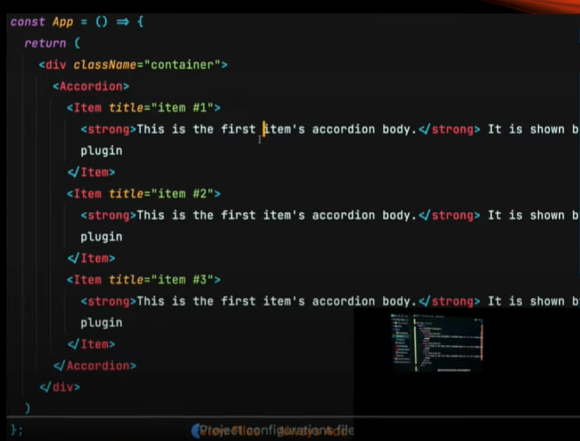
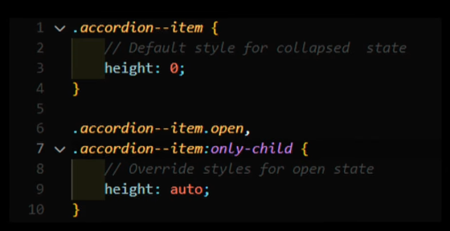
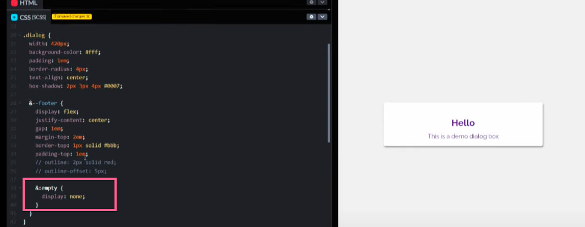

# Amit Sheen - React problems, CSS solutions | ReactNext 2021

[video link](https://www.youtube.com/watch?v=GW8sAZOUntg&list=PLMYVq3z1QxSq8U5MBE5XE3pcBQt75bZXk&index=20)

## accordian

If there is only one item in `accordian`, then it should be opened by default.

But how do we know how many items?




### JS solution.


### CSS solution.



---

## Dialog


- if comment out both `approveProps` and `cancelProps`


### CSS solutions



```css
&:empty {
  display: none;
}
```

---

## User List


### Scenario

- `odd` align left
- `even` align right.

### CSS solutions


```css
&:nth-child(odd) {
  aligh-self: flex-start;
}
&:nth-child(even) {
  aligh-self: flex-end;
}
```

To be responsive

```css
@media (min-width: 460px) {
  &:nth-child(odd) {
    aligh-self: flex-start;
  }
  &:nth-child(even) {
    aligh-self: flex-end;
  }
}
```

## Pseudo-classes


```css
::before
::after
```

## User List has zero user


### CSS solutions


```css
&:empty::after {
  content: 'No result';
  ## can be dynamic with attr
  content: attr(content);
  color: red;
  ...;
}
```

- [w3school attr()](https://www.w3schools.com/cssref/func_attr.asp)
- [mdn attr()](https://developer.mozilla.org/en-US/docs/Web/CSS/attr)

## Conclusion


## Resources

- [stylestage](https://stylestage.dev/)
  can only use `css` with the same `html`.
