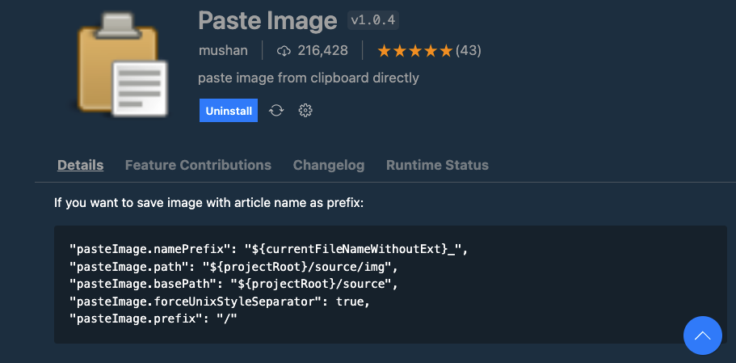
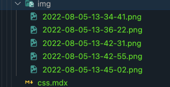

# VSCode Extensions Detail

## `mushan.vscode-paste-image`



### Settings

```json title=".vscode/settings.json"
{
 ...,
  // paste image to markdown
  "pasteImage.path": "${currentFileDir}/img",
  "pasteImage.insertPattern": ""
}
```

```json title=".vscode/extension.json"
{
  "recommendations": [
   ...,
    "mushan.vscode-paste-image"
  ]
}
```

### Command

For example in `Mac`

- copy image: `cmd+ctrl+shift+4`
- paste image to markdown: `cmd+opt+v`

### Result

- generate folder `img` and with the image file inside.
- generate the image link in the markdown file. format like this: ``


